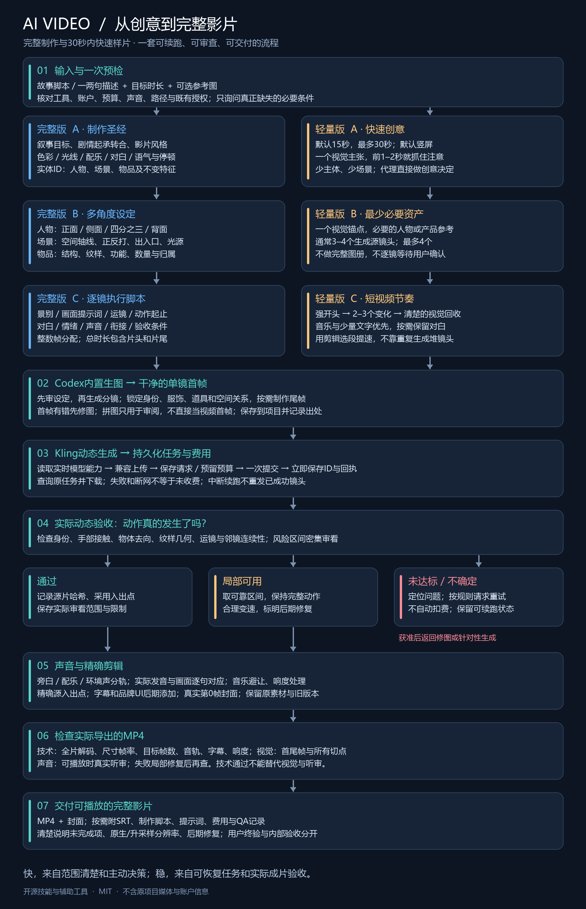

# AI Video SOP Skills

**一句创意 → 设定与分镜 → Codex 生图 → Kling 动态 → 声音剪辑 → 完整视频。**

两套可分别安装的 Codex 技能，提炼自知识科普、文化品牌、产品科技、婚礼仪式和剧情微电影的制作与返修流程。完整版追求叙事与连续性；轻量版缩小制作范围，优先快速给出好看的短视频样例。

> 这是供 Codex 执行的开源技能与本地辅助工具，不是独立运行的文生视频模型。需要宿主提供内置生图、已连接的 Kling 账户，以及本地 Python/FFmpeg。生成可能收费、排队或需要首次授权；不承诺无人值守、固定分钟内完成或零瑕疵。仓库不包含原项目影片、人物照片、账户信息或音乐。

## 选择一个入口

| | 完整版 `ai-video-director` | 轻量版 `ai-video-quick` |
|---|---|---|
| 输入 | 剧本/一两句描述、时长、可选参考图 | 一两句描述、可选参考图/时长 |
| 默认 | 60秒、16:9、1080p、24fps | 15秒、9:16、1080p、30fps |
| 目标 | 完整叙事、角色与场景体系、正式成片 | 最多30秒，开头抓人、少角色、少场景 |
| 图像准备 | 多角度人物/场景/物品设定＋逐镜画面 | 一个视觉锚点＋必要的3–4个镜头画面 |
| 交互 | 默认自主推进，可按用户要求审核 | 默认直接执行，不逐镜求确认 |
| 输出 | MP4、封面、字幕、制作脚本、账目与QA | MP4与封面优先，提示词/账目留档 |

## 安装

把下面任一文件夹**整体复制**到 Codex 能发现技能的位置（通常为 `$CODEX_HOME/skills` 或 `~/.codex/skills`）。可重命名安装文件夹为 `ai-video-director` / `ai-video-quick`，调用名取自 `SKILL.md` 的 `name`。若有固定工作区规则，应遵循该规则，通过宿主支持的技能路径/目录联接进行发现，而不是擅自写入其他目录。

- [`project_039_skill_ai-video-director`](project_039_skill_ai-video-director/SKILL.md)
- [`project_040_skill_ai-video-quick`](project_040_skill_ai-video-quick/SKILL.md)

两个目录各自带完整运行脚本与参考手册，可以只安装其中一个。无需安装本仓库其他文件夹。安装完成后开启新会话以便发现技能。

先确认：Codex 内置生图可调用；Kling MCP/官方 CLI 已登录且额度足够；Python 3.10+、FFmpeg 与 ffprobe 可用（FFmpeg需含libx264、libass以及常见音频滤镜）。若不在 PATH，可设置 `FFMPEG` / `FFPROBE` 指向现有程序。需要对白/配乐时，还需已授权的音频工具或可用音频素材。不会自动购买套餐、充值或安装全局软件。

## 直接使用

```text
使用 $ai-video-director：做一支90秒的短片，讲一位年轻人回乡继承家里的陶艺店。
整体温暖、写实，有少量旁白。附图是主角与陶器参考，保持面孔和器型一致。
```

```text
使用 $ai-video-quick：雨夜里的银色跑鞋，水花、霓虹倒影、速度感。
做15秒竖屏样片，直接开始，采用我已经授权的工具和预算。
```

用户不必填写JSON或所有分镜字段。Codex负责补齐计划并执行。第一次连接服务、权限范围不足、付费重试或预算无法满足时，仍可能需要一次必要的问答。既有明确授权应复用，不逐笔重复确认。

## 具体 SOP



- [完整中文 SOP 与分支说明](docs/SOP.zh-CN.md)
- [可编辑 Mermaid 流程图](docs/workflow.mmd)
- [SVG 流程图](docs/workflow.svg)
- [故障经验与设计理由](docs/production-lessons.md)
- [验证方法与边界](docs/VALIDATION.md)

## 稳定性设计

1. **脚本先于批量付费**：锁定角色、服饰、场景轴线和道具状态，再扩展镜头。
2. **动作和稳定性分别验收**：不把静止画面加推镜当成已经发生的动作。
3. **付费任务持久化**：提交前占用预算，回执和ID立即保存，中断后查原任务。
4. **按真实采用段落审看**：审看记录绑定文件哈希及源入出点，更换源片自动失效。
5. **精确时间轴**：整数帧核算，不靠循环短片或黑场凑时长。
6. **成片检查**：技术检测、视觉检查、听审各自记录，互不冒充。

默认本地组装器支持顺切、选段变速、源声音、对白/配乐/音效混合、音乐避让、响度处理、SRT及封面；复杂视觉转场由代理另行制作并重新验收。它不直接调用原生生图/Kling，也不自动作艺术判断。

## 开发与验证

```text
python -m unittest discover -s tests -v
python tools/check_bundle.py
```

FFmpeg存在时测试会生成本地合成素材并真实导出短MP4，不调用收费AI。测试缓存放在仓库的 `work/`（已忽略）；用 `VIDEO_SOP_TEST_ROOT` 可指定其他允许目录。发布包只包含技能、文档、合成示例清单和测试代码。

## License

[MIT](LICENSE) 适用于本仓库代码与文档。模型服务条款、账户额度以及用户图片、人物形象、音乐、品牌和生成素材的授权分别处理；本仓库不对这些素材授予额外权利。
